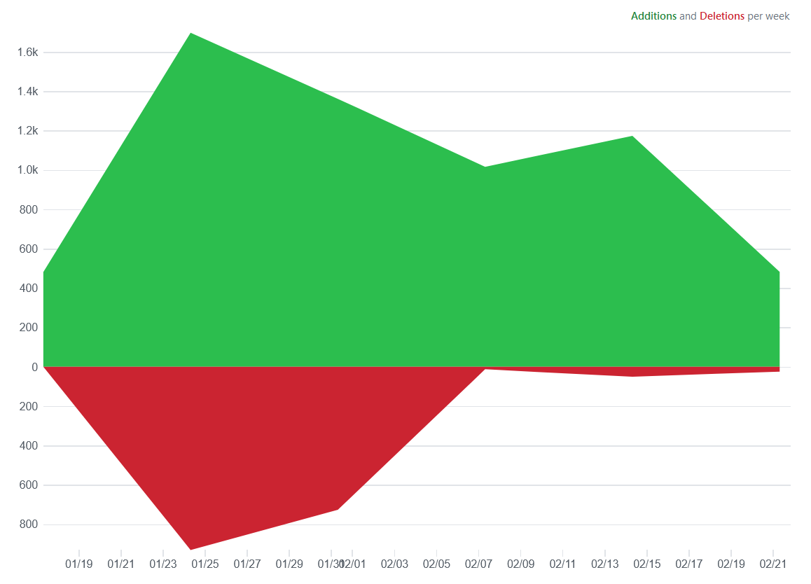

# Lanqiao

## 1.1 算法很美(AlgorithmIsSoBeautiful)

先练内功，再练武功  
[这里有笔记](https://github.com/zimo999mrx/Lanqiao/blob/master/src/AlgorithmIsSoBeautiful/Notes.md) -
感谢csdn大佬``` xcsxchen ```的分享

- [x] 1 位运算
- [x] 2 查找、排序(初级)
- [x] 3 查找、排序(高级)
- [x] 4 矩阵
- [x] 5 字符串
- [x] 6 数学问题
- [ ] 7 递归、DFS、剪枝
- [ ] 8 贪心、动态规划

## 1.2 刷题

刷刷刷

# 日志

21/03/05  
压力有点大，视频还有数据结构的内容，但是时间不太允许我看。  
看完贪心，就去刷题先！！

---

21/02/21  
以为放假在家会学一下习，结果还是太懒了，一个月没看完视频，放个图证明一下自己还是有学的  

